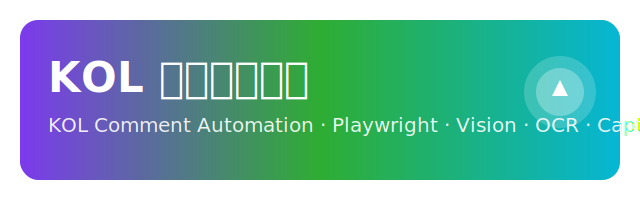

<!-- 文件说明：项目根 README，用于项目介绍与双语文档入口，提升开源观感与专业度 -->

  
  <h1>KOL 评论区引流器 · KOL Comment Automation</h1>
  
  

    
    
    
    
    
    
    
  

---

## 简介（中文）

- 本项目致力于在 YouTube / B 站 / 抖音 等平台上进行“类人”的评论发布与视觉自动化监控。
- 采用服务化架构 + 行为内核（ActionKernel）+ 选择器自学习，结合 OCR（文字识别）与验证码处理，追求工业级稳定性与可维护性。

### 主要特性
- 视觉 OCR 预处理与 GPU→CPU 自动降级，鲁棒识别。
- 滑块等验证码检测与拟人化拖动策略，提升通过率。
- 选择器版本化与历史记录，平台变更自动回退与更新。
- Playwright 驱动的浏览器自动化，支持无头与代理配置（`.env`）。
- 统一日志与异常分层，预防性错误处理与性能打点。
- CI/Pre-commit/单元测试骨架，保障质量与演进。

### 快速开始
- 安装依赖：`pip install -r 评论区引流器/-2/requirements.txt`
- 安装浏览器：`python -m playwright install`
- 配置环境（可选）：创建 `评论区引流器/-2/.env`，示例见 `评论区引流器/-2/.env.example`
- 运行示例：`python 评论区引流器/-2/e2e/smoke_comment.py`

### 目录结构
- `评论区引流器/-2/services/`：服务层（`browser_service.py`、`task_service.py`）
- `评论区引流器/ghost_protocol/phase_2_task_executor/`：行为内核与任务执行器
- `评论区引流器/-2/visual_automation/`：视觉核心与验证码模块
- `评论区引流器/-2/tests/`：基础测试与环境校验

### 展示与演示
- 仓库页面预览：
- 后续将补充自动化流程演示 GIF（登录需私密凭证，演示将选择公开可访问的流程片段）。

### 路线图
- 验证码类型完整覆盖（拼图/点击/旋转）。
- 单测覆盖率提升到 80%+；增加更全面的 E2E。
- 选择器更新工具与数据驱动策略优化。

### 贡献指南
- 欢迎 Issue 与 PR；请遵循现有代码风格与预提交钩子（`pre-commit`）。
- 运行 `pre-commit install` 后开发，保持一致格式与简单清晰的实现。

### 许可证
- 本项目采用 MIT 许可证，详见 `LICENSE`。

---

## Overview (English)

- This project aims at human-like comment posting and visual automation across platforms such as YouTube / Bilibili / Douyin.
- Architecture: service layer + ActionKernel + selector self-learning, combined with OCR and captcha handling for industrial-grade stability and maintainability.

### Highlights
- Robust OCR preprocessing with automatic GPU→CPU fallback.
- Slider-like captcha detection and human-like dragging strategy to increase pass rate.
- Selector versioning and history tracking to adapt to platform changes.
- Playwright-based browser automation; headless and proxy configured via `.env`.
- Unified logging with layered exceptions and performance instrumentation.
- CI / pre-commit / unit-test skeleton to ensure quality.

### Quick Start
- Install deps: `pip install -r 评论区引流器/-2/requirements.txt`
- Install browsers: `python -m playwright install`
- Configure env (optional): create `评论区引流器/-2/.env`, sample at `评论区引流器/-2/.env.example`
- Run example: `python 评论区引流器/-2/e2e/smoke_comment.py`

### Structure
- `评论区引流器/-2/services/`: service layer (`browser_service.py`, `task_service.py`)
- `评论区引流器/ghost_protocol/phase_2_task_executor/`: action kernel & task executor
- `评论区引流器/-2/visual_automation/`: vision core & captcha solver
- `评论区引流器/-2/tests/`: basic tests and environment checks

### Roadmap
- Full captcha types coverage (jigsaw / click / rotate).
- 80%+ unit test coverage; more E2E scenarios.
- Data-driven selector updates and tooling enhancements.

### Contributing
- Issues and PRs are welcome. Please follow existing code style and `pre-commit` hooks.

### License
- MIT License. See `LICENSE` for details.

---

## Links
- Repo: https://github.com/CHANGGELY/kol-comment-automation
- Playwright: https://playwright.dev
- Docs: [中文](docs/README.zh.md) | [English](docs/README.en.md)
- CI: GitHub Actions Windows runner (flake8, pytest + coverage → Codecov)
